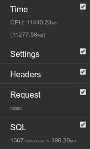

### Instructions

* create virtualenv

`pip install -r path/to/requirements.txt`

`python manage.py migrate`

`python manage.py generate_data (took 20 seconds)`

create django admin

`python manage.py createsuperuser`

`python manage.py runserver`

user view: http://localhost:8000/
admin panel: http://localhost:8000/admin

### Results
* categories: 1364
* products: 13806

